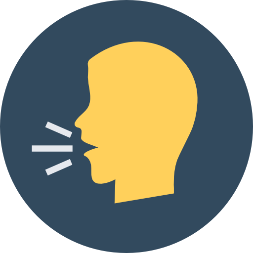

 
  

&#xa0;

<h1 align="center">O Leitor</h1>

 

## :dart: About

📚 O Leitor ler seus textos na hora que você mais precisar

## :sparkles: Features

- Fala o que você escreve

## :rocket: Technologies

As seguintes ferramentas foram utilizadas neste projeto:

- [HTML](https://developer.mozilla.org/pt-BR/docs/Web/HTML)
- [CSS](https://developer.mozilla.org/pt-BR/docs/Web/CSS)
- [Javascript](https://developer.mozilla.org/pt-BR/docs/Web/JavaScript)

## :white_check_mark: Requirements

Before starting :checkered_flag:, you need to have [Git](https://git-scm.com) installed.

## :memo: License

Este projeto está sob licença do MIT. Para obter mais detalhes, consulte o arquivo [LICENSE](LICENSE.md).

Created :heart: by <a href="https://github.com/samuelrochati" target="_blank">Samuel S. Rocha</a>

&#xa0;

<a href="#top">Back to top</a>
